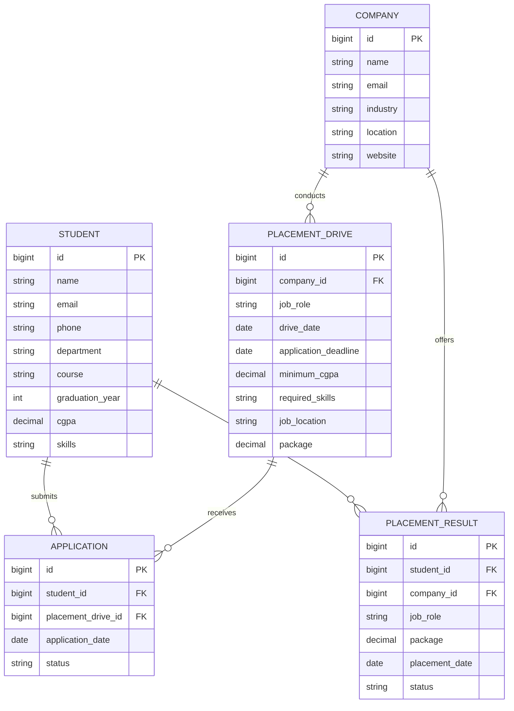

# ER Diagram

## 1. Entity Relationship Overview

```text
+-------------+       +-------------------+
|   COMPANY   | 1   N |  PLACEMENT_DRIVE  |
+-------------+-------+-------------------+
                         |
                         | 1
                         | 
                         | N
                  +----------------+
                  |  APPLICATION   |
                  +----------------+
                    N |          | N
                      |          |
                      |          |
                    1 |          | 1
                +---------+   +---------+
                | STUDENT |   |  DRIVE  |
                +---------+   +---------+

Student -------------------- Placement Result
    1                              N
```

## 2. Mermaid ER Diagram

The following Mermaid diagram can be rendered by GitHub-compatible Markdown viewers:



## 3. Note

The diagram represents the proposed logical model. The final diagram should be updated if the implemented entity fields differ.
